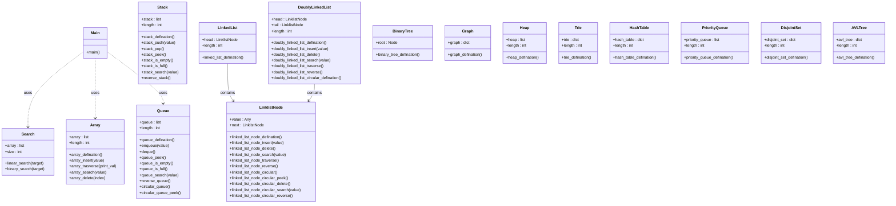

# Codebase Architecture

## Class Diagram

```mermaid
classDiagram
    class Main {
        +main()
    }

    class Search {
        +array : list
        +size : int
        +linear_search(target)
        +binary_search(target)
    }

    class Array {
        +array : list
        +length : int
        +array_defination()
        +array_insert(value)
        +array_trasverse(print_val)
        +array_search(value)
        +array_delete(index)
    }

    class Stack {
        +stack : list
        +length : int
        +stack_defination()
        +stack_push(value)
        +stack_pop()
        +stack_peek()
        +stack_is_empty()
        +stack_is_full()
        +stack_search(value)
        +reverse_stack()
    }

    class Queue {
        +queue : list
        +length : int
        +queue_defination()
        +enqueue(value)
        +deque()
        +queue_peek()
        +queue_is_empty()
        +queue_is_full()
        +queue_search(value)
        +reverse_queue()
        +circular_queue()
        +circular_queue_peek()
    }

    class LinklistNode {
        +value : Any
        +next : LinklistNode
        +linked_list_node_defination()
        +linked_list_node_insert(value)
        +linked_list_node_delete()
        +linked_list_node_search(value)
        +linked_list_node_traverse()
        +linked_list_node_reverse()
        +linked_list_node_circular()
        +linked_list_node_circular_peek()
        +linked_list_node_circular_delete()
        +linked_list_node_circular_search(value)
        +linked_list_node_circular_reverse()
    }

    class LinkedList {
        +head : LinklistNode
        +length : int
        +linked_list_defination()
    }

    class DoublyLinkedList {
        +head : LinklistNode
        +tail : LinklistNode
        +length : int
        +doubly_linked_list_defination()
        +doubly_linked_list_insert(value)
        +doubly_linked_list_delete()
        +doubly_linked_list_search(value)
        +doubly_linked_list_traverse()
        +doubly_linked_list_reverse()
        +doubly_linked_list_circular_defination()
    }

    class BinaryTree {
        +root : Node
        +binary_tree_defination()
    }

    class Graph {
        +graph : dict
        +graph_defination()
    }

    class Heap {
        +heap : list
        +length : int
        +heap_defination()
    }

    class Trie {
        +trie : dict
        +length : int
        +trie_defination()
    }

    class HashTable {
        +hash_table : dict
        +length : int
        +hash_table_defination()
    }

    class PriorityQueue {
        +priority_queue : list
        +length : int
        +priority_queue_defination()
    }

    class DisjointSet {
        +disjoint_set : dict
        +length : int
        +disjoint_set_defination()
    }

    class AVLTree {
        +avl_tree : dict
        +length : int
        +avl_tree_defination()
    }

    %% Relationships
    Main ..> Search : uses
    Main ..> Array : uses
    Main ..> Queue : uses
    LinkedList --> LinklistNode : contains
    DoublyLinkedList --> LinklistNode : contains
```
